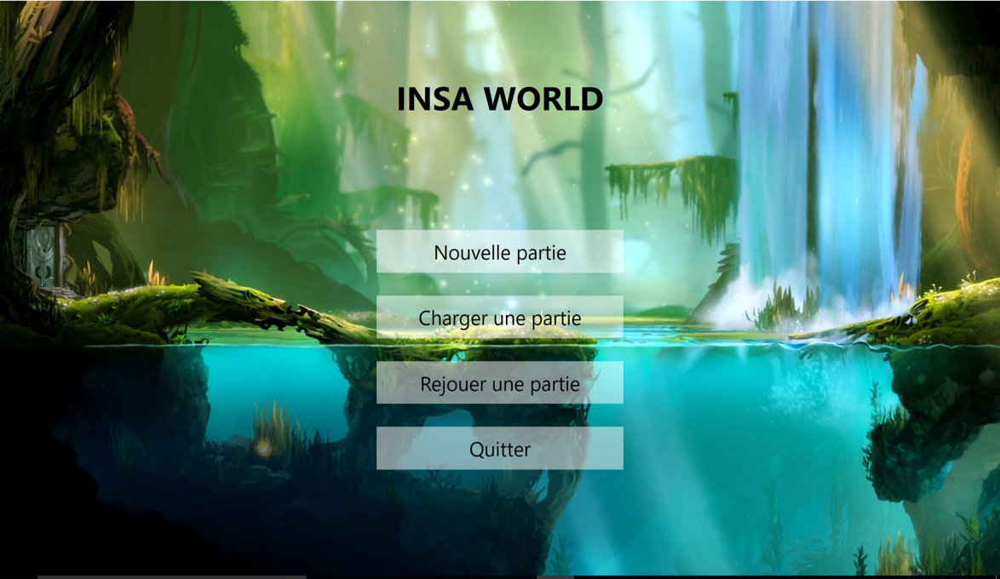

# INSAWorld

This project has been realized in the frame of the 4th year OOP module in the computer science department at INSA Rennes.

The Visual Studio solution is divided in three parts.

## C++ Library

This library supplies three algorithms :
- An algorithm allowing to generate a map while considering the constraints described in the specification
- An algorithm allowing to arrange players units fairly
- An algorithm generating unit move suggestions during the game, it suggests the best move, i.e. the move making the most of points

## C# Model Implementation

This part included the set of classes allowing to play a game and also these allowing to replay a saved game.

## C# Software Testing

This part included the set of unit tests allowing to test features provided by the C++ library and C# model.

## Screenshots

